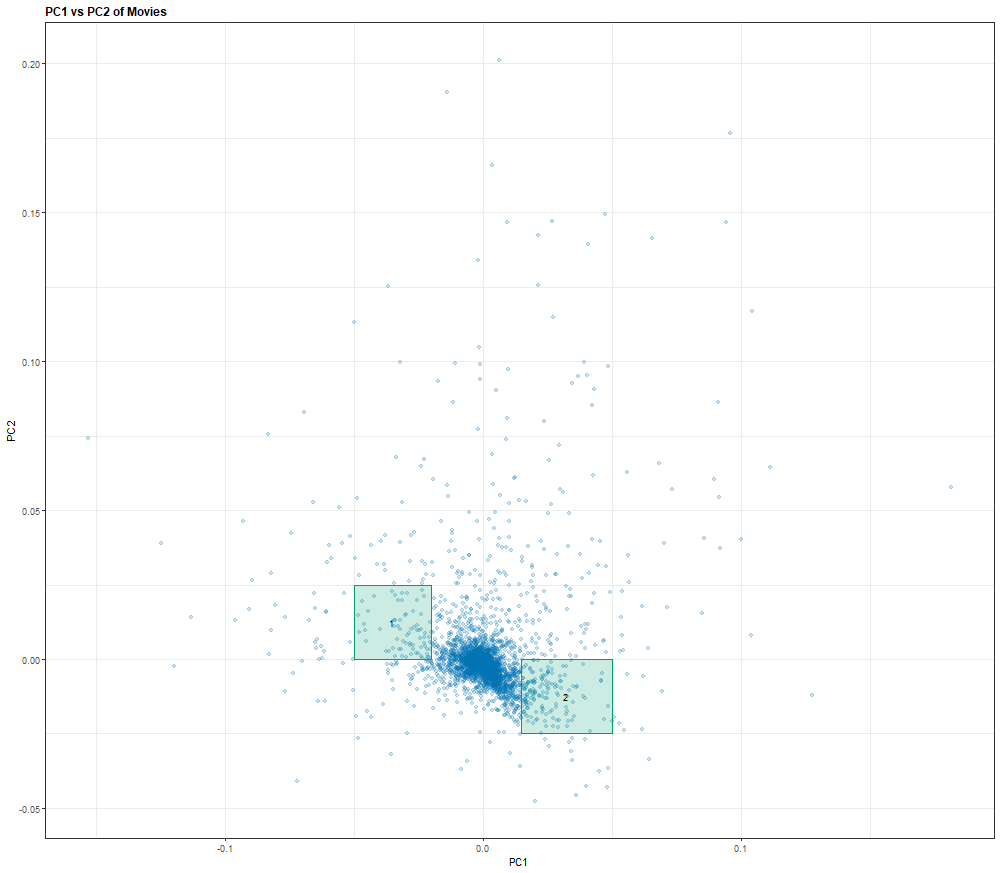
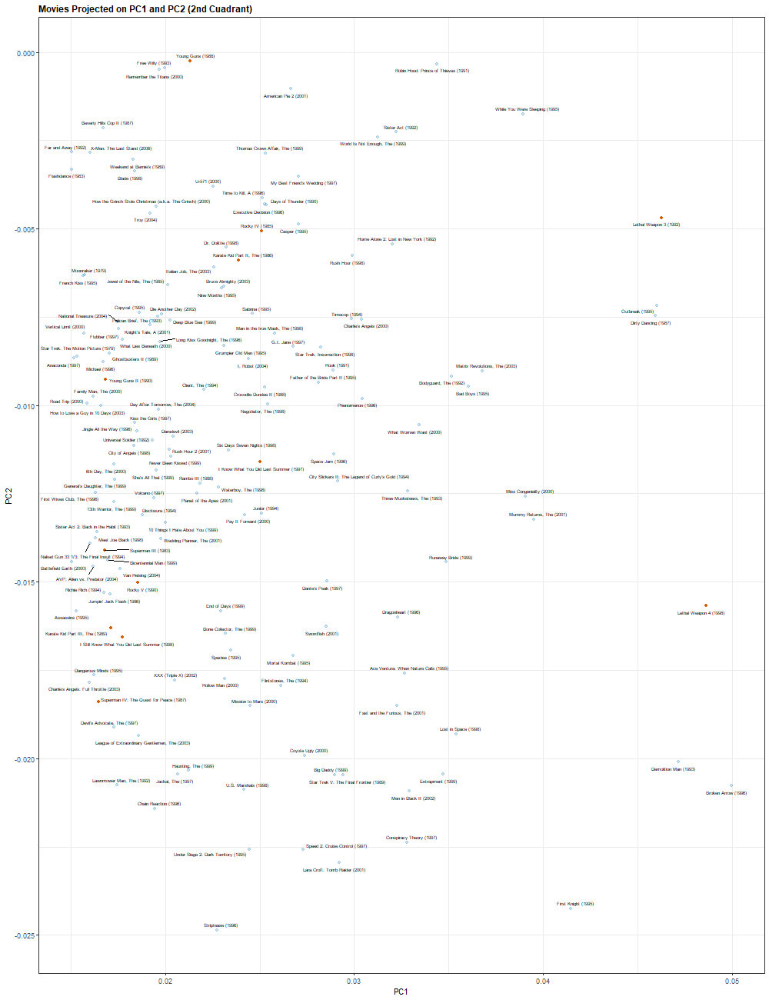

```{r setup, include=FALSE}
# Default options of all chunks in the document:
knitr::opts_chunk$set(echo = FALSE, warning=FALSE, message=FALSE, size = 10,fig.pos = "!H", out.extra = "")
```
\newpage

# Introduction.

A recommendation system is a machine learning algorithm that predicts the rating or preference a user would give to a particular item. You might have used this kind of system in your daily life even without noticing it. Every time you use your favorite web browser it is most likely that some interesting ads are shown to you that conveniently meet your needs. Or maybe when listening to music on a streaming service you feel pleased with the songs that are played after your first pick. Well, that is thanks to recommendation systems that most of companies nowadays use in order to target their products for specific audiences. Google, Amazon, Netflix, Youtube, Spotify and Facebook are just a few examples of services that are guiding you through recommendation systems towards the most likely product you might purchase, watch, hear, follow or read.

The GroupLens reaserch lab generated the MovieLens dataset with over 20 million ratings over 27,000 movies by more than 138,000 users. The objective of this project is to show how to build a recommendation system which could predict the rating a user will give to a movie, based on this data. For this purpose we will use a 10 million version of the MovieLens dataset to make the computation a little easier.

A similar challenge was launched by Netflix in October 2006, in which they offer a million dollar award to the team who could improve their recommendation algorithm by 10%. They decided on a winner based on a metric called "Residual Mean Squared Error (RMSE)". To win the Netflix prize a participating team had to get an RMSE of approximately 0.857 (or smaller). On September 18, 2009, Netflix announced the team "BellKor's Pragmatic Chaos" as the winner of the challenge with a Test RMSE of 0.8567.

If we build an algorithm that predicts the rating for certain movies and consider that those predictions will have some errors which are the difference between the predicted rating and the true rating given by the users, then the smaller these differences, the better the algorithm has performed. The RMSE is just a way to measure these differences and this is the metric we will use to describe how well our recommendation algorithm performs. 

As a beginner in the data science world, I have come across many interesting challenges like learning a programming language from scratch, diving into statistics and probability, dealing with great amounts of information and computationally heavy tasks and deciphering the information available regarding most of the concepts and techniques I have learn so far. Therefore, I have focused on explaining and illustrating many basic concepts in Layman's terms. Nonetheless, this paper also includes an important amount of information explaining technicalities and equations.

The reader will find throughout this paper the application of three main techniques: linear regression  models (normalization of global effects),  regularization, and matrix factorization.
\newpage

# Getting Started.

## Machine Learning Basics.

Before going further, let's explain some basics of Machine Learning (ML):

1). ML means, as its name implies, teaching or training a machine to learn to do something. This can be achieved by building an algorithm. In this case, we want to train a machine to predict movie ratings.

2). There are different types of ML algorithms: supervised, semi-supervised, unsupervised and reinforcement. In this case, we use supervised algorithms, which means the machine is taught by example. In other words, we show to the machine a dataset (i.e. MovieLens) that includes inputs (i.e. users, movie titles, movie genres, dates of rating, etc.) and outputs (i.e. movie ratings), so the algorithm must find the way to determine new outputs given new inputs. This is one of the reasons why recommendation systems are a powerful tool, they improve the user experience by offering movies that best fit to their preferences or by showing a repertoire they might not discover otherwise due to the large movie inventory.

3). When using a supervised ML algorithm, it is implied that we have a dataset with the variables (inputs) and their results (outputs) which we will use to train our algorithm. But, how can we measure the accuracy of the algorithm if we are predicting movie ratings of movies or users that are not contained in our dataset but instead will be present in the future? How can we test our algorithm? Do we wait until the users rate new movies, we process this new information and then we measure how well our algorithm performs? Well, we certainly don't. Instead you split your dataset (the one you currently have), say 80%-20%. We can use the 80% of the data to train an algorithm and then test it in the 20% of the remaining data, simulating the movies that users will rate in the future. As we know the true ratings of the 20% contained in the test set, thus we can measure the accuracy of our predictions with a metric such the RMSE.

4). A train set in ML is used to perform all the calculations of the algorithm. On the other hand, a test set is only used to evaluate those calculations. Imagine that you are teaching a kid to multiply 1-digit number by 2, and you want to know how good is he at multiplications so you ask him to multiply a 1-digit number by 2. The kid will most likely answer correctly, but that doesn't mean he has understood the concept of multiplication, not even the concept of multiplying a number with more than 1-digit by 2. So testing his learnings that way would result in an over-optimistic assessment (this concept is called overfitting). 

5). We can create many ML models for the same problem. Each one will result in different predictions and thus, will have different accuracy on its own. But we can "ensemble" different models so we can predict taking into account the results of each model. In an ensemble, the prediction is improved due to the evaluation of the ensemble as a whole. For example, if we want to predict which class of ticket a person buys (class "A", "B" or "C") and we train 10 ML algorithms and for a given user 6 models predict "A", 2 models predict "B" and 2 models predict "C", then we can evaluate that 60% of our models predict the same results, so it is most likely that this prediction would be the best one.  

6). In ML there are parameters required in our model which are not features (variables) and they may change the result of the predictions. For example, if a model predicts based on how near is a user to a certain facility (i.e. gas stations), you should tell the model how to interpret the concept "near": it could be a distance (i.e. all gas stations within a given radius) or it could be a minimum of facilities (i.e. the 5 nearest gas stations). Both distance and minimum facilities would be parameters and different values of parameters will result in different estimates. This implies that depending on the value of the parameters the model would be more or less accurate. Therefore, a parameter can be tuned to optimize a model. A well known tuning technique is Cross Validation (CV). 

## Tools and Resources.

This project can be downloaded from [this link](https://github.com/rafaelyanlab/movielens). During the development of this project the following tools and resources were employed: 

* Programming Language: [R](https://www.r-project.org/).
* Integrated Development Environment (IDE): RStudio.
* Operating System (OS): Microsoft Windows 10 Home Single Language.
* System Type: x64-based PC.
* Processor: Intel(R) Core(TM) i7-7700HQ CPU @ 2.80GHz, 2801 Mhz, 4 core processors, 8 thread processors.
* Installed Physical Memory (RAM): 8.00 GB.
* Total Physical Memory: 7.83 GB.
* Available Physical Memory: 1.46 to 2.4 GB.
* Code Hosting Service: GitHub.

## Data Wrangling^[This pdf section corresponds to section "Code Provided" of the R script.].

First of all, we download the MovieLens dataset [from this link](https://grouplens.org/datasets/movielens/10m/) which has a zip file containing two files:

* movies.dat
* ratings.dat

Then we joined the two sets together and split the data into two sets:

* __validation__: contains only the 10% of the data and will be used as our _test set_.
* __edx__: contains the rest of the data and will be used as our _train set_.

If a userId or a movieId is just in the _test set_, then we will remove it and add it back to the _train set_. This will be helpful when building our model because we would expect to make predictions only of known users and known movies which are on our _train set_.

## Data Exploration^[This pdf section corresponds to section "II. DATA EXPLORATION (DESCRIPTIVE STATISTICS)" and "III. RELATIONSHIP BETWEEN VARIABLES AND RATINGS" of the R script.].

```{r libraries}
# Load libraries
# if(!require(knitr)) install.packages("knitr", repos = "http://cran.us.r-project.org")
# if(!require(rmarkdown)) install.packages("rmarkdown", repos = "http://cran.us.r-project.org")
# if(!require(kableExtra)) install.packages("kableExtra", repos = "http://cran.us.r-project.org")

if(!require(tidyverse)) install.packages("tidyverse", repos = "http://cran.us.r-project.org")
if(!require(caret)) install.packages("caret", repos = "http://cran.us.r-project.org")
if(!require(data.table)) install.packages("data.table", repos = "http://cran.us.r-project.org")

if(!require(gridExtra)) install.packages("gridExtra", repos = "http://cran.us.r-project.org")
#if(!require(readr)) install.packages("readr", repos = "http://cran.us.r-project.org")
if(!require(stringr)) install.packages("stringr", repos = "http://cran.us.r-project.org")
if(!require(lubridate)) install.packages("lubridate", repos = "http://cran.us.r-project.org")
if(!require(Matrix)) install.packages("Matrix", repos = "http://cran.us.r-project.org")

# library(kableExtra)
library(tidyverse)
library(caret)
#library(data.table)
library(gridExtra)
#library(readr)
#library(stringr)
library(lubridate)
library(Matrix)
```

```{r loading train set}
# Note:
# Before you continue make sure you run the R script "01_movielens" until section "INTRODUCTION ii. Code provided" where the edx and the validation sets are created and saved in the folder "data" of your working directory. 

# This piece of code considers that you've already created the edx and validation sets:
edx <- readRDS("data/edx.rda") 
```

Both our train set (__edx__) and test set (__validation__) are composed by 6 columns or variables:

```{r edx first rows}
edx[1:8,] %>%
  knitr::kable(caption = "First rows from edx set.") %>%
  kableExtra::kable_styling(latex_options = c("striped","hold_position","scale_down")) %>%
  kableExtra::row_spec(0,bold=T)
```

The columns *title* and *genres* are variables of class character, the rest of the variables are numeric. Note that the column *title* contains the release year in parentheses, a movie can have several genres separated by a pipe operator "|". The column *timestamp* variable represents seconds since January 1, 1970 (so technically it is a date and we should treat it like so). So let us add two more columns to our dataset:

1. The premiere or release year of a movie (*year*): this represents an additional variable in our dataset and it is extracted from *title*.
2. The date a movie has been rated (*rating_date*): this is just a transformation of *timestamp*, hence is not an additional variable. If we just convert the *timestamp* from the actual format to a date format, we will end up with a huge list of unique dates, and thus there will be less ratings by each one of these dates. Instead we can transform the *timestamp* a way that many dates can be treated as one single group, and thus there will be more ratings by each one of these groups (this will be important for regularization). We will create a rating_date which is the first day of the week described in the *timestamp*.

Now the __edx__ set looks like this:

```{r example edx first rows}
# We can see that the title of each movie contains the release year. We would add a column to both sets with this value:
edx <- edx %>%
  mutate(year = as.numeric(str_extract(str_sub(title,start=-6),"(\\d{4})")))

edx <- edx %>%
  mutate(date = as_datetime(timestamp))

edx <- edx %>%
  mutate(week=week(date), rating_date = round_date(date,unit="week"))

edx <- edx %>%
  select(-date,-week)

# Show example
edx[1:8,] %>%
  knitr::kable(caption = "First rows from edx set with additional columns.") %>%
  kableExtra::kable_styling(latex_options = c("striped","hold_position","scale_down")) %>%
  kableExtra::row_spec(0,bold=T)
```

The *userId*, *movieId*, *timestamp*, *title*, *genres*, *year* and *rating_date* are our __independent variables__. On the other hand *rating* is our __dependent variable__. So, we will build a model which predicts *ratings* based on what we know about the users, the movies, the genres of the movies, the premiere year of a movie and the time a user has rated a movie.

Note that because *title* and *movieId* refers to the same item (the first one as a text and the last one as an ID) then we can consider just one of them. For simplicity we will choose *movieId* as the independent variable. The same thing happens with *timestamp* and *rating_date*. We will use *rating_date* as our independent variable because many *timestamp* dates can be grouped by the same *rating_date*.

Considering this, we have 5 variables we can use to train a model which predicts ratings but, are those variables meaningful to train a model? To answer this question we will first explore our data available in the __edx__ set. Here are some descriptive statistics of our _train_ set:

* __`r format(nrow(edx), big.mark=",")`__ total observations, each one representing a rating of a movie given by a user.
* __`r format(nrow(edx %>% distinct(movieId)),big.mark=",")`__ unique movies (min ID = _`r min(edx$movieId)`_ and max ID = _`r max(edx$movieId)`_).
* __`r format(nrow(edx %>% distinct(userId)),big.mark=",")`__ unique users (min ID = _`r min(edx$userId)`_ and max ID _`r max(edx$userId)`_).
* __`r format(nrow(edx %>% distinct(genres)),big.mark =",")`__ unique group of genres.
* The first rating was made on __`r year(as_datetime(min(edx$timestamp)))`__.
* The most recent rating was made on __`r year(as_datetime(max(edx$timestamp)))`__.
* The most frequent rating is 4 stars. Whole star ratings are more common than half star ratings: 

```{r ratings frequence, echo=FALSE, fig.cap="Frequence of ratings on edx set.", fig.align = 'center',fig.pos="H", out.width = '80%'}
# See code in section "II. DATA EXPLORATION (DESCRIPTIVE STATISTICS)" of the R script.

```
  
Now let us explore the behaviour of ratings (our dependent variable) based on our 5 independent variables separately. For this purpose we will group all our data by each element of each variable (i.e. each user in userId). Then we will summarize how many times we find this element in our dataset (*cases*) and which is the average rating considering all the cases we found (*avg_rating*). Here is an example:

```{r example users summary}
users <- edx %>%
  group_by(userId) %>%
  summarize(cases=n(),avg_rating = mean(rating)) %>%
  arrange(desc(cases))

users[1:10,] %>%
  knitr::kable(caption = "Summary by userId.") %>%
  kableExtra::kable_styling(latex_options = c("striped","hold_position"),full_width = F) %>%
  kableExtra::row_spec(0,bold=T)
```

As shown on the table above user `r users$userId[1]` appears `r format(users$cases[1],big.mark=",")` times and his average rating is `r users$avg_rating[1]`. The table shows only the first 10 *userId* ordered by *cases*.

Repeating this step for each variable we obtain the following scatter plots and histograms:

* Each pair of graphs defines a variable (i.e. movieId).
* Each dot in the scatter plot is a unique element (i.e. movie) of that variable.
* The dotted line in both graphs represents the mean rating by variable.
* On the top right of the histogram it is shown the average rating (*mean*) and the standard deviation (*sd*) of each variable.

```{r avg ratings by variable, echo=FALSE, fig.cap="Average rating by variable.", fig.align = 'center',fig.pos="H", out.width = '100%'}
# See code in section "III. RELATIONSHIP BETWEEN VARIABLES AND RATINGS" of the R script.

```

From the figures above we can see that *movie*, *user* and *genre* histograms are more spread out than those of *year* and *date of rating*. Above each histogram is shown its corresponding standard deviation (sd). Larger standard deviation means greater variability. Variability in a feature is important to ML algorithms because it impacts the capacity of a model to use that feature: if a feature has little variance, then it has no ability to contribute to the model.

Hence, the first three variables (movie, genre and user) are more likely to help to make predictions than the last two variables (release year and date of rating). With this insight we can start to train our models.

\newpage

# Methods and Analysis.

## Predictions and Evaluation of the Models^[This pdf section corresponds to section "IV RMSE FUNCTION" of the R script.].

Our goal in this project is to predict the rating any given user would assing to any given movie. Here is an example of some users and the movies they have rated in our __edx__ set:
  
```{r um_edx}
um_edx <- edx %>%
  filter(userId <=20 & movieId <= 10) %>%
  select(userId,rating,title) %>%
  spread(key=title,value=rating) %>%
  replace(is.na(.), "")

um_edx %>%
  knitr::kable(caption = "Example of movie ratings by user.") %>%
  kableExtra::kable_styling(latex_options = c("striped","hold_position"),full_width = F) %>%
  kableExtra::column_spec(1:7,width="1.8cm") %>%
  kableExtra::row_spec(0,bold=T)
```

As we can see, no user has rated all movies. The challenge is to estimate a rating for all the missing values (we will use different algorithms with different approaches). If we do a good job then our estimates would be similar to the true ratings, we would evaluate the precision of our algorithm with the RMSE. Remember that we use the __validation__ set as a sample of known true ratings where we can test our predictions. Suppose that we train a model with our __edx__ set and the prediction we get from user "5" and movie "Heat" is 2.5 stars and we know that the true rating (from the __validation__ set) is 3 stars. Then the error of our prediction would be:
  
$$
  error = true_{rating} - prediction = 3 stars - 2.5 stars = 0.5 stars
$$
  
If we repeat this calculation for all our predictions then we have to __sum__ all our errors. We must consider that some values could be positive and some others could be negative, therefore we first __square__ the errors so the positive values don't cancel out the negative values. Then we divide our result by the number of predictions we made in order to get the __mean__ error. Note that since we previously squared our errors, then the unit of our result is *stars^2^* thus we __square root__ it to turn it back to our original unit (*stars*). This value is known as the *Root Mean Square Error* or *RMSE*, and it can be written as:
  
$$
  RMSE = \sqrt{\frac{1}{N}\sum_{i=1}^{N}{(true_{rating_i} - prediction_i)^2}}
$$
Once we are able to predict all ratings for any given user and any given movie, then we can *recommend* movies to users just by showing them only those movies we predict they would like the most (movies with more stars). In this project we will just predict the ratings, we won't make the recommendation of the top "N" movies to the users.

## Models Implemented.

The models we will train for our recommendation system follow one of the these approaches:

__1. Linear regression.__ In this approach we will start from a baseline predictor (i.e. average rating of all movies) and then we will add the effect of a specific variable (i.e. movie effect, user effect, genre effect, etc.). Redarding this approach Yehuda Koren, one of the winner of the Netflix challenge, wrote in his article "The BellKor Solution to the Netflix Grand Prize" (Korean, 2009, p.9):

*"Out of the numerous new algorithmic contributions, I would like to highlight one – those humble baseline predictors (or biases), which capture main effects in the data. While the literature mostly concentrates on the more sophisticated algorithmic aspects, we have learned that an accurate treatment of main effects is probably at least as significant as coming up with modeling breakthroughs".*

To illustrate this model, let us take the following example:

* User effect: Isabella is an easygoing user so she tends to rate movies on average 0.4 stars higher than other users.
* Movie effect: Back to the Future is a classic movie and maybe is 0.6 stars higher than the average movie.
* Genre effect: Suppose that science fiction movies tend to be 0.8 lower than other film genres.

If the average of all movies is 3.5 stars (baseline predictor), then our prediction for Isabella rating Back to the Future would be:

3.5 stars (baseline) + 0.4 stars (user effect) + 0.6 stars (movie effect) - 0.8 (genre effect) = __3.7 stars__ 


__2. Matrix factorization.__ This model detect patterns or latent factors between groups of movies or groups of users. Note that this interaction between groups of movies or users can't be accounted for with our first approach. To illustrate this model, consider the following example:
  
  If Isabella likes Harry Potter Part-3 there's a good chance that she would enjoy the rest of the saga, moreover there is a chance that she would enjoy other films like Lord of the Rings, Star Wars, Indiana Jones, Pan's Labyrinth, Jurassic Park and Noah. Here are some assumptions why this may happen:
  
  * The fan factor: Isabella is very into the Harry Potter world, she knows the story, the characters, the places, etc. so she would enjoy all the saga despite of the quality, the cast or the production of the film.
  * The fantasy factor: Letting aside that she is a huge fan, in general she likes fantasy so she also will enjoy Lord of the Rings or Star Wars.
  * The direction and production factor: Not only she likes fantasy but she likes very much Cuaron's films so maybe she will enjoy Pan's Labyrinth too.
  * The music factor: Isabella loves John Williams' music, so maybe Jurassic Park has the right mix of fantasy and music she expects in a movie, and so has Star Wars.
  * The cast factor: Besides, Isabella likes very much Emma Watson, so maybe Noah would be a nice choice for her.

Now if we consider that there are many patterns like the ones described above, theoretically, if we could realize of the presence of these patterns, we could decompose our prediction in these factors making our model more accurate.

One way we can obtain these patterns is with Principal Component Analysis (PCA) or Singular Value Decomposition (SVD) which allow us to find the correlations or the lack of correlation among the variables in a matrix, i.e. a user-movie ratings matrix where movies are columns, users are rows and the numbers inside the matrix are the ratings for each combination of column and row (user-movie). These methods will decompose our matrix in Principal Components that can be thought of as the patterns we are looking for.

This decomposition is called matrix factorization and the mathematical principles applied in these methods allow us to find the similarities among our movies and our users, no matter if the "latent factors" that give us these similarities are not interpretable. In other words, we don't have to be aware that a fan, music, fantasy, direction or cast factor exists, the method will just find those patterns.

PCA and SVD are in fact known as dimensionality reduction methods that we will use for matrix factorization purposes.


## Linear Regression Models^[This pdf section corresponds to section "V. NORMALIZATION EFFECTS MODELS" of the R script.].

### Baseline Predictor Model.


As we explained before, we will start from a baseline predictor which will be defined as the average of all the ratings in our __edx__ set. This average would be our first prediction:
  
$$
  Y_{u,m} = \mu + \epsilon_{u,m}
$$
  
* $Y_{u,m}$ = the rating for user *u* and movie *m*.

* $\mu$ = the rating average of all movies in the __edx__ set.

* $\epsilon_{u,m}$ = an independent error for user *u* and movie *m* sampled from the same distribution centered at 0.

If we want an estimate of $\mu$, this is $\hat\mu$ where the hat symbol "^" means "estimate", then the Central Limit Theorem (CTL) tells us that we can just use $\mu$, the rating average of all the observations in our dataset (`r round(mean(edx$rating),digits=4)`). Thus, our prediction would be the following:
  
```{r prediction extract model 1}
prediction_results_extract <- readRDS("rda/prediction_results_extract.rda")

prediction_results_extract %>%
  select(userId,movieId,title,true_rating,avg) %>%
  setNames(c("user","movie","title","true rating","model 1"))%>%
  knitr::kable(caption = "Example of predictions of model 1.") %>%
  kableExtra::kable_styling(latex_options = c("striped","hold_position"),full_width = F) %>%
  kableExtra::row_spec(0,bold=T)
```

Note that the table above is just an extract of our entire prediction that we will be using for illustration purposes. To evaluate the performance of our first model we compare all the true ratings in our __validation__ set with predictions in our __edx__ set with our predictions in the __edx__ set and obtain the RMSE of our algorithm:
  
```{r rmse model 1}
# RMSE results of all models that were calculated with the R script are stored in this object:
rmse_results <- readRDS("rda/rmse_results.rda")

rmse_results[1,1:3] %>%
  knitr::kable(caption = "RMSE of model 1.") %>%
  kableExtra::kable_styling(latex_options = c("striped","hold_position"),full_width = F) %>%
  kableExtra::row_spec(0,bold=T)
```

### Average + Movie Effect Model.

Now we will add the movie effect to our baseline predictor. This represents how many stars on average is a movie above or under the rating average of all the dataset. Our model now would be described as follows:

\newpage

$$
Y_{u,m} = \mu + b_m + \epsilon_{u,m}
$$

* $Y_{u,m}$ = the rating we predict for user *u* and movie *m*.

* $\mu$ = the rating average of all movies in the __edx__ set.

* $b_m$ = bias due to the movie effect.

* $\epsilon_{u,m}$ = an independent error for user *u* and movie *m* sampled from the same distribution centered at 0.

In this case the Least Squares Estimate of $b_m$ which minimizes our RMSE is the average of $Y_{u,m} - \hat\mu$ for each movie *m*:

$$
\hat{b_m} = \frac{1}{n_m}\sum^{n_m}(Y_{u,m} - \hat\mu)
$$
where:

* $\hat{b_m}$ = estimate of the bias or effect for movie *m*.

* $n_m$ = number of ratings of movie *m*.

* $\hat\mu$ = estimate of the average of all ratings (model 1).

So, first we will calculate the mean rating of each movie and then we will substract $\hat\mu$ which we can estimate using the following piece of code:

```{r b_m , echo = T, eval=F}
mu <- mean(edx$rating)

b_m <- edx %>% 
  group_by(movieId,title) %>% 
  summarize(mean_rating = mean(rating), mu = mu ,b_m = mean(rating - mu))

prediction <- mu + validation %>% 
  left_join(b_m, by='movieId') %>%
  .$b_m %>%
  as.data.frame()
```

```{r b_m table example}
b_m <- readRDS("rda/b_m.rda")
b_m
```

From what we can see `r b_m$title[1]` tend to be rated `r b_m$b_m[1]` stars above the average rating and `r b_m$title[2]` tend to be rated `r b_m$b_m[2]` stars below the average rating.

\newpage

Now we are ready to predict based on the average rating and the movie effect, here are some examples:

```{r prediction extract model 1 and 2}
prediction_results_extract %>%
  select(userId,movieId,title,true_rating,avg,avg_movie_effect) %>%
  setNames(c("user","movie","title","true rating","model 1","model 2")) %>%
  knitr::kable(caption = "Example of predictions of model 1 and model 2.") %>%
  kableExtra::kable_styling(latex_options = c("striped","hold_position"),full_width = F) %>%
  kableExtra::row_spec(0,bold=T)
```

Note that the RMSE of this model is lower than the one of our first algorithm:
  
```{r RMSE model 2}
rmse_results[1:2,1:3]  %>%
  knitr::kable(caption = "RMSE of first two models.") %>%
  kableExtra::kable_styling(latex_options = c("striped","hold_position"),full_width = F) %>%
  kableExtra::row_spec(0,bold=T)
```


### Average + Genre, User, Premiere Year or Date of Rating Effect Models.

In the next models we will apply the same approach as in our previous model. This time we will consider the rating average of all observations plus the bias due to the effects of genre, user, premiere year and date of rating. We will analyze each effect separately using the following models: 
  
$$
  Y_{u,m} = \mu + b_g + \epsilon_{u,m}
$$
$$
  Y_{u,m} = \mu + b_u + \epsilon_{u,m}
$$
$$
  Y_{u,m} = \mu + b_y + \epsilon_{u,m}
$$
$$
  Y_{u,m} = \mu + b_d + \epsilon_{u,m}
$$
  
  
* $Y_{u,m}$ = the rating for user *u* and movie *m*.

* $\mu$ = the rating average of all movies in the __edx__ set.

* $b_g$ = bias due to the genre effect.

* $b_u$ = bias due to the user effect.

* $b_y$ = bias due to the year effect.

* $b_d$ = bias due to the date of rating effect.

* $\epsilon_{u,m}$ = an independent error for user *u* and movie *m* sampled from the same distribution centered at 0.

The Least Squares Estimate of $b_g$, $b_u$, $b_y$ and $b_d$ which minimizes our RMSE is the average of $Y_{u,m}$ - $\hat\mu$. In this case, the average of $Y_{u,m}$ is calculated in each equation by a different effect: genre, user, year and date. Therefore, the bias of each variable is determined by the following piece of code:
  
```{r all other bias , echo = T, eval=F}
mu <- mean(edx$rating)

b_g <- edx %>%
  group_by(genres) %>%
  summarize(b_g = mean(rating - mu))

b_u <- edx %>% 
  group_by(userId) %>% 
  summarize(b_u = mean(rating - mu))

b_y <- edx %>% 
  group_by(year) %>% 
  summarize(b_y = mean(rating - mu))

b_d <- edx %>% 
  group_by(rating_date) %>% 
  summarize(b_d = mean(rating - mu))

# prediction for genre effect:
prediction <- mu + validation %>% 
  left_join(b_g, by='genres') %>%
  .$b_g %>%
  as.data.frame()

# prediction for user effect:
prediction <- mu + validation %>% 
  left_join(b_u, by='userId') %>%
  .$b_u %>%
  as.data.frame()

# prediction for year effect:
prediction <- mu + validation %>% 
  left_join(b_y, by='year') %>%
  .$b_y %>%
  as.data.frame()

# prediction for date of rating effect:
prediction <- mu + validation %>% 
  left_join(b_d, by='rating_date') %>%
  .$b_d %>%
  as.data.frame()
```

\newpage

The RMSE of these models are:

```{r RMSE models 1 to 6}
rmse_results[1:6,1:3]  %>%
  knitr::kable(caption = "RMSE of models 1 to 6.") %>%
  kableExtra::kable_styling(latex_options = c("striped","hold_position"),full_width = F) %>%
  kableExtra::row_spec(0,bold=T)
```

Here are some examples of the predictions applying each model:
  
```{r prediction extract model 1 to 6}
prediction_results_extract %>%
  select(userId,movieId,title,true_rating,avg,avg_movie_effect,avg_genre_effect,avg_user_effect,avg_year_effect,avg_date_effect) %>%
  setNames(c("user","movie","title","true rating","model 1","model 2","model 3","model 4","model 5","model 6")) %>%
  knitr::kable(caption = "Example of predictions of model 1 to model 6.") %>%
  kableExtra::kable_styling(latex_options = c("striped","hold_position","scale_down"),full_width = F) %>%
  kableExtra::row_spec(0,bold=T)
```

When analyzing the effects separately the ones which seem to perform better are *movie*, *user* and *genre*, while *year* and *date of rating* have little improvement respect the average alone. We expected this based on the scatter plots and the histograms we built in the previous chapter.

### Average + Movie + User Effect Model.

As you may noticed using global effects separately didn't improve our predictions very much. The best RMSE until now is `r min(rmse_results[1:6,3])` this means our error is almost of 1 star.  

Let us try to capture the movie and user effect (our two best models) in the same algorithm:

$$
Y_{u,m} = \mu + b_m + b_u + \epsilon_{u,m}
$$

The Least Squares Estimate of $b_m$ and $b_u$ which minimizes our RMSE are:

* Movie bias^[This is the same equation as the one we used in model 2.]:
$$
\hat{b_m} = \frac{1}{n_m}\sum^{n_m}(Y_{u,m} - \hat\mu)
$$

\newpage

* User bias:
$$
\hat{b_u} = \frac{1}{n_u}\sum^{n_u}(Y_{u,m} - \hat\mu - \hat{b_m})
$$

where:

* $\hat{b_u}$ = estimate of the bias or effect for user *u*.

* $n_u$ = number of ratings of user *u*.

* $\hat\mu$ = estimate of the average of all ratings (model 1).

* $\hat{b_m}$ = estimate of the bias or effect for movie *m* which we calculate with the first equation.

Both equations can be calculated with the next piece of code:

```{r movie effect + user effect, echo = T, eval = F}
mu <- mean(edx$rating)

b_m <- edx %>% 
  group_by(movieId) %>% 
  summarize(b_m = mean(rating - mu))

b_u <- edx %>%
  left_join(b_m,by="movieId") %>%
  group_by(userId) %>% 
  summarize(b_u = mean(rating - mu - b_m))

prediction <- validation %>% 
  left_join(b_m, by='movieId') %>%
  left_join(b_u, by='userId') %>%
  mutate(pred = mu + b_m + b_u) %>%
  .$pred %>%
  as.data.frame()
```

The RMSE for this model is shown in the following table. The other results are shown for comparison purposes:

```{r RMSE models 1 to 7}
rmse_results[1:7,1:3]  %>%
  knitr::kable(caption = "RMSE of models 1 to 7.") %>%
  kableExtra::kable_styling(latex_options = c("striped","hold_position"),full_width = F) %>%
  kableExtra::row_spec(0,bold=T)
```

We can see that our model had a significant improvement. Here are some results of models 2 (movie effect alone), 4 (user effect alone) and 7 (movie and user effect together):

\newpage

```{r prediction extract model 7}
prediction_results_extract %>%
  select(userId,movieId,title,true_rating,avg_movie_effect,avg_user_effect,avg_movie_user_effect) %>%
  setNames(c("user","movie","title","true rating","model 2","model 4","model 7")) %>%
  knitr::kable(caption = "Example of predictions of model 2, 4 and 7.") %>%
  kableExtra::kable_styling(latex_options = c("striped","hold_position"),full_width = F) %>%
  kableExtra::row_spec(0,bold=T)
```

When mixing both effects now we see that our lowest prediction is less than 0 and our higher prediction is greater than 5 which in fact are out of the real rating parameters:

```{r range predictions model 7}
prediction_results <- readRDS("rda/prediction_results.rda")

range(prediction_results$avg_movie_user_effect)
```

So we can fix this with the next piece of code:

```{r Out of Range Correction, echo = T , eval=F}
prediction <- validation %>% 
  left_join(b_m, by='movieId') %>%
  left_join(b_u, by='userId') %>%
  mutate(pred = ifelse(mu + b_m + b_u < 0,0,ifelse(mu + b_m + b_u >5,5,mu + b_m + b_u))) %>%
  .$pred %>%
  as.data.frame()
```

We will refer to this prediction as *model 8* and it is just the prediction of *model 7* with the out of range (OOR) correction. The RMSE now is:

```{r RMSE models 1 to 8}
rmse_results[1:8,1:3]  %>%
  knitr::kable(caption = "RMSE of models 1 to 8.") %>%
  kableExtra::kable_styling(latex_options = c("striped","hold_position"),full_width = F) %>%
  kableExtra::row_spec(0,bold=T)
```


\newpage

### Average + All Effects Model.

The next model will consider all of the effects together. This time we will correct from the beginning all the predictions that are out of range. The equation of our model is:

$$
Y_{u,m} = \mu + b_m + b_u + b_g + b_y + b_d + \epsilon_{u,m}
$$

The Least Squares Estimate of the biases which minimizes our RMSE are:


* Movie bias^[This is the same equation as the one we used in model 2.]:
$$
\hat{b_m} = \frac{1}{n_m}\sum^{n_m}(Y_{u,m} - \hat\mu)
$$

* User bias^[This is the same equation as the one we used in model 7.]:
$$
\hat{b_u} = \frac{1}{n_u}\sum^{n_u}(Y_{u,m} - \hat\mu - \hat{b_m})
$$

* Genre bias:
$$
\hat{b_g} = \frac{1}{n_g}\sum^{n_g}(Y_{u,m} - \hat\mu - \hat{b_m} - \hat{b_u})
$$

* Year bias:
$$
\hat{b_y} = \frac{1}{n_y}\sum^{n_y}(Y_{u,m} - \hat\mu - \hat{b_m} - \hat{b_u} - \hat{b_g})
$$

* Date of rating bias:
$$
\hat{b_d} = \frac{1}{n_d}\sum^{n_d}(Y_{u,m} - \hat\mu - \hat{b_m} - \hat{b_u} - \hat{b_g} - \hat{b_y})
$$

where:

* $\hat{b_{...}}$ = estimate of the bias or effect for user *u*, genre *g*, year *y* and date *d*.

* $n_{...}$ = number of ratings of user *u*, genre *g*, year *y* and date *d*.

* $\hat\mu$ = estimate of the average of all ratings (model 1).

These equations can be calculated with the next piece of code:

```{r all effects, echo = T, eval = F}
mu <- mean(edx$rating)

b_m <- edx %>% 
  group_by(movieId) %>% 
  summarize(b_m = mean(rating - mu))

b_u <- edx %>%
  left_join(b_m,by="movieId") %>%
  group_by(userId) %>% 
  summarize(b_u = mean(rating - mu - b_m))

b_g <- edx %>%
  left_join(b_m,by="movieId") %>%
  left_join(b_u,by="userId") %>%
  group_by(genres) %>% 
  summarize(b_g = mean(rating - mu - b_m - b_u))

b_d <- edx %>%
  left_join(b_m,by="movieId") %>%
  left_join(b_u,by="userId") %>%
  left_join(b_g,by="genres") %>%
  group_by(rating_date) %>% 
  summarize(b_d = mean(rating - mu - b_m - b_u - b_g))

b_y <- edx %>%
  left_join(b_m,by="movieId") %>%
  left_join(b_u,by="userId") %>%
  left_join(b_g,by="genres") %>%
  left_join(b_d,by="rating_date") %>%
  group_by(year) %>% 
  summarize(b_y = mean(rating - mu - b_m - b_u - b_g - b_d))

prediction <- validation %>% 
  left_join(b_m, by='movieId') %>%
  left_join(b_u, by='userId') %>%
  left_join(b_g, by='genres') %>%
  left_join(b_d,by="rating_date") %>%
  left_join(b_y,by="year") %>%
  mutate(pred = ifelse(mu + b_m + b_u + b_g + b_d + b_y < 0,
                       0,
                       ifelse(mu + b_m + b_u + b_g + b_d + b_y >5,
                              5,
                              mu + b_m + b_u + b_g + b_d + b_y))) %>%
  .$pred %>%
  as.data.frame()
```

The RMSE for this model is shown in the following table. The other results are shown for comparison purposes:

```{r RMSE models 1 to 9}
rmse_results[1:9,1:3]  %>%
  knitr::kable(caption = "RMSE of models 1 to 9.") %>%
  kableExtra::kable_styling(latex_options = c("striped","hold_position"),full_width = F) %>%
  kableExtra::row_spec(0,bold=T)
```

Here are some results of models 8 and 9:

\newpage

```{r prediction extract model 9}
prediction_results_extract %>%
  select(userId,movieId,title,true_rating,avg_movie_user_effect_corrected,avg_all_effects) %>%
  setNames(c("user","movie","title","true rating","model 8","model 9")) %>%
  knitr::kable(caption = "Example of predictions of models 8 and 9.") %>%
  kableExtra::kable_styling(latex_options = c("striped","hold_position"),full_width = F) %>%
  kableExtra::row_spec(0,bold=T)
```

## Regularization Models^[This pdf section corresponds to section "V.X Model 10 Regularization" of the R script].

One problem with our predictions in the last model, which seems to be the best in terms of the RMSE, is that the estimates of the biases $b_m$, $b_u$, $b_g$, $b_y$ and $b_d$ are prone to be larger (positive or negative) when there is just a __few samples__ when estimated. Let us count the movies which were rated 20 or fewer times:

```{r movies less than 20, echo = T}
movies_20_less <- nrow(edx %>%
                         group_by(movieId) %>%
                         summarize(cases = n()) %>%
                         ungroup() %>%
                         filter(cases<=20))
movies_20_less
```

These movies represent `r movies_20_less / nrow(edx %>% distinct(movieId)) * 100`% of all the movies in the __edx__ set and will cause $b_m$ to be larger and hence increase our RMSE.

Here are the number of users that rated 20 or fewer movies:

```{r users less than 20 ratings, echo = T}
users_20_less <- nrow(edx %>%
                        group_by(userId) %>%
                        summarize(cases = n()) %>%
                        ungroup() %>%
                        filter(cases<=20))
users_20_less
```

These users represent `r users_20_less / nrow(edx %>% distinct(userId)) * 100`% of all the users in the __edx__ set and will cause $b_u$ to be larger and hence increase our RMSE.

To better illustrate this idea let us take our Least Squares Estimate which minimizes our RMSE in *model 2* (the average of $Y_{u,m} - \hat\mu$ for each movie *m*):

$$
\hat{b_m} = \frac{1}{n_m}\sum^{n_m}(Y_{u,m} - \hat\mu)
$$
Suppose that movie $m_x$ has 1,000 ratings ($n_m$) and $m_y$ has only 10 ratings, then the average of $Y_{u,m} - \hat\mu$ will be very precise for movie $m_x$ since it is calculated with 1,000 observations. On the other hand, our estimate for movie $m_y$ will be calculated with only 10 observations, which will lead us to a very inaccurate prediction.

__Regularization__ is a technique we can use to penalize large estimates that are produced when using small samples. Therefore, we will minimize the following equation with the penalty term $\lambda$:

$$
\frac{1}{N}\sum_{u,m}(y_{u,m} - \mu - b_m - b_u - b_g - b_y - b_d)^2 + \lambda(\sum_mb_m^2 + \sum_ub_u^2 + \sum_gb_g^2 + \sum_yb_y^2 + \sum_db_d^2)
$$
The optimal values for the estimates with regularization are:

* Movie effect:
$$
\hat{b_m}(\lambda) = \frac{1}{(\lambda + n_m)}\sum_{}^{n_m}(Y_{u,m} - \hat{\mu})
$$

* User effect:
$$
\hat{b_u}(\lambda) = \frac{1}{(\lambda + n_u)}\sum_{}^{n_u}(Y_{u,m} - \hat{\mu} - \hat{b_m}(\lambda))
$$

* Genre effect:
$$
\hat{b_g}(\lambda) = \frac{1}{(\lambda + n_g)}\sum_{}^{n_g}(Y_{u,m} - \hat{\mu} - \hat{b_m}(\lambda) - \hat{b_u}(\lambda))
$$

* Year effect:
$$
\hat{b_y}(\lambda) = \frac{1}{(\lambda + n_y)}\sum_{}^{n_y}(Y_{u,m} - \hat{\mu} - \hat{b_m}(\lambda) - \hat{b_u}(\lambda) - \hat{b_g}(\lambda))
$$

* Date of rating effect:
$$
\hat{b_d}(\lambda) = \frac{1}{(\lambda + n_d)}\sum_{}^{n_d}(Y_{u,m} - \hat{\mu} - \hat{b_m}(\lambda) - \hat{b_u}(\lambda) - \hat{b_g}(\lambda) - \hat{b_y}(\lambda))
$$

where:

* $\lambda$ = penalty term.
* $n_{...}$ = the number of ratings for movie *m*, user *u*, genre *g*, year *y* and date of rating *d*.
* $\hat{b_{...}}$ = the bias due to movie, user, genre, year and date of rating effect.

Hence, the equation of our model is:

$$
Y_{u,m} = \mu + b_m(\lambda) + b_u(\lambda) + b_g(\lambda) + b_y(\lambda) + b_d(\lambda) + \epsilon_{u,m}
$$
Let us consider that $\lambda$ equals 1, if $n$ is very large, then $\lambda$ won't change our estimate very much since the term $\lambda + n$ (1 + n) in the denominator will be larger and thus, similar to $n$ (the result is not affected by the regularization penalty). But if $n$ is small, then our estimate will be shrunken towards zero since $\lambda + n$ (1 + n) in the denominator will be smaller (the result is affected by the regularization penalty).

Note that lambda ($\lambda$) is a __parameter__ that can be __tuned__, thus we can seek the best value of $\lambda$ which minimizes the RMSE. This means that we need to evaluate different values of $\lambda$ to see which one leads us to the best prediction. But **we can't use our test set** (*validation set*) to seek for the best $\lambda$ so we will use __cross-validation__ (CV) to accomplish our goal using 10 folds (k-folds) of our __edx__ set as follows:

* We build 10 samples of our __edx__ set with the 90% of the observations where we train the model and tune for $\lambda$
* We build 10 samples with the remaining 10% of the observations to estimate the RMSE in this set and find the best $\lambda$.
* Note that we use part of the train set to find the $\lambda$, we're not using the __validation__ set.

The code we can use for tuning for $\lambda$ is:

```{r tuning for lambda, echo = T, eval = F}
set.seed(1, sample.kind="Rounding")

# We create 10 folds to perform CV
k_folds_index <- createFolds(edx$movieId,k=10,list=TRUE,returnTrain = TRUE)

mu <- mean(edx$rating)

# Range adjusted from 3.5 to 5.5 after analysis, but it can be any range.
lambdas <- seq(3.5,5.5,.15) 

# Partitioning train set in two:
# train_fold = 90% of the k_th fold, and,
# validation_fold = 10% of the remaining data.

# Here is an example of the 1st fold
k <- 1

# This is the train set used for cross validation where k indicates the number of the fold.
train_fold <- edx[k_folds_index[[k]],]

# This is the validation set used for the cross validation
validation_fold <- edx[-k_folds_index[[k]],]

# Now we can tune for lambda with the following function.
# We are going to use the first fold (k = 1).
# So let's test our function (this could take several minutes):

rmses <- sapply(lambdas,function(lambda){
  b_m <- train_fold %>% 
    group_by(movieId) %>% 
    summarize(b_m = sum(rating - mu)/(n()+lambda))
  
  b_u <- train_fold %>% 
    left_join(b_m, by="movieId") %>%
    group_by(userId) %>% 
    summarize(b_u = sum(rating - mu - b_m)/(n()+lambda))
  
  b_g <- train_fold %>%
    left_join(b_m,by="movieId") %>%
    left_join(b_u,by="userId") %>%
    group_by(genres) %>% 
    summarize(b_g = sum(rating - mu - b_m - b_u)/(n()+lambda))
  
  b_d <- train_fold %>%
    left_join(b_m,by="movieId") %>%
    left_join(b_u,by="userId") %>%
    left_join(b_g,by="genres") %>%
    group_by(rating_date) %>% 
    summarize(b_d = sum(rating - mu - b_m - b_u - b_g)/n()+lambda)

  b_y <- train_fold %>%
    left_join(b_m,by="movieId") %>%
    left_join(b_u,by="userId") %>%
    left_join(b_g,by="genres") %>%
    left_join(b_d,by="rating_date") %>%
    group_by(year) %>% 
    summarize(b_y = sum(rating - mu - b_m - b_u - b_g - b_d)/(n()+lambda))
  
  prediction <- validation_fold %>% 
    left_join(b_m, by='movieId') %>%
    left_join(b_u, by='userId') %>%
    left_join(b_g, by='genres') %>%
    left_join(b_d, by="rating_date") %>%
    left_join(b_y, by="year") %>%
    mutate(pred = ifelse(mu + b_m + b_u + b_g + b_d + b_y < 0,
                         0,
                         ifelse(mu + b_m + b_u + b_g + b_d + b_y >5,
                                5,
                                mu + b_m + b_u + b_g + b_d + b_y)))

  # Since we splitted the data 90%-10% it is possible that some observations result in NA
  # when left-joining. So we identify those observations and substract them from both sets
  # and calculate RMSE only with the remaining observations:
  
  index_preserve <- which(!is.na(prediction$pred))
  p <- prediction$pred[index_preserve]
  v <- validation_fold$rating[index_preserve]
  
  return(RMSE(p,v))
})
```

The result of our tuning process is:

```{r tuning results for lambda}
tuning_results_lambda <- readRDS("rda/tuning_results_lambda.rda")

tuning_results_lambda %>%
  knitr::kable(caption = "Tuning results for Lambda using Cross-Validation.") %>%
  kableExtra::kable_styling(latex_options = c("striped","hold_position","scale_down"),full_width = F) %>%
  kableExtra::row_spec(0,bold=T)
```

\newpage

The following plot shows the results for each fold in our previous table. The red dotted lines indicates the intercept of the $\lambda$ which minimizes the RMSE:

```{r graph lambda, echo=FALSE, fig.cap="Best Lambda using Cross Validation with 10 folds", fig.align = 'center',fig.pos="H", out.width = '70%'}

```

With these results we calculate the mean RMSE of the 10 k-folds for each value of $\lambda$:

```{r mean RMSE for each lambda}
lambdas <- seq(3.5,5.5,.15)

mean_rmse_lambdas <- readRDS("rda/mean_rmse_lambdas.rda") %>% as.data.frame()

mean_rmse_lambdas %>%
  knitr::kable(caption = "Mean RMSE for each value of Lambda.") %>%
  kableExtra::kable_styling(latex_options = c("striped","hold_position")) %>%
  kableExtra::row_spec(0,bold=T)
```

The value of $\lambda$ with the lowest mean RMSE is the best lambda (our tuned penalty parameter). In this case our best $\lambda$ equals to `r lambdas[which.min(mean_rmse_lambdas$mean_rmse)]` (mean RMSE = `r min(mean_rmse_lambdas$mean_rmse)`).

Now we can train our model with our penalty term $\lambda$ = `r lambdas[which.min(mean_rmse_lambdas$mean_rmse)]` with the following piece of code:

```{r model 10, echo = T, eval = F}
mu <- mean(edx$rating)

# We define best lambda as:

best_lambda <- 4.7

b_m <- edx %>% 
  group_by(movieId) %>% 
  summarize(b_m = sum(rating - mu)/(n()+best_lambda))

b_u <- edx %>% 
  left_join(b_m, by="movieId") %>%
  group_by(userId) %>% 
  summarize(b_u = sum(rating - mu - b_m)/(n()+best_lambda))

b_g <- edx %>%
  left_join(b_m,by="movieId") %>%
  left_join(b_u,by="userId") %>%
  group_by(genres) %>% 
  summarize(b_g = sum(rating - mu - b_m - b_u)/(n()+best_lambda))

b_d <- edx %>%
  left_join(b_m,by="movieId") %>%
  left_join(b_u,by="userId") %>%
  left_join(b_g,by="genres") %>%
  group_by(rating_date) %>% 
  summarize(b_d = sum(rating - mu - b_m - b_u - b_g)/n()+best_lambda)

b_y <- edx %>%
  left_join(b_m,by="movieId") %>%
  left_join(b_u,by="userId") %>%
  left_join(b_g,by="genres") %>%
  left_join(b_d,by="rating_date") %>%
  group_by(year) %>% 
  summarize(b_y = sum(rating - mu - b_m - b_u - b_g - b_d)/(n()+best_lambda))

prediction <- validation %>% 
  left_join(b_m, by='movieId') %>%
  left_join(b_u, by='userId') %>%
  left_join(b_g, by='genres') %>%
  left_join(b_d, by="rating_date") %>%
  left_join(b_y, by="year") %>%
  mutate(pred = ifelse(mu + b_m + b_u + b_g + b_d + b_y < 0,
                       0,
                       ifelse(mu + b_m + b_u + b_g + b_d + b_y >5,
                              5,
                              mu + b_m + b_u + b_g + b_d + b_y))) %>%
  .$pred %>%
  as.data.frame()
```

The RMSE for this model 10 is shown in the following table:

```{r RMSE models 1 to 10}
rmse_results[1:10,1:3]  %>%
  knitr::kable(caption = "RMSE of models 1 to 10.") %>%
  kableExtra::kable_styling(latex_options = c("striped","hold_position"),full_width = F) %>%
  kableExtra::row_spec(0,bold=T)
```

Here are some results of models 9 and 10:

```{r prediction extract model 9 and 10}
prediction_results_extract %>%
  select(userId,movieId,title,true_rating,avg_all_effects,avg_all_effects_regularization) %>%
  setNames(c("user","movie","title","true rating","model 9","model 10")) %>%
  knitr::kable(caption = "Example of predictions of models 9 and 10.") %>%
  kableExtra::kable_styling(latex_options = c("striped","hold_position"),full_width = F) %>%
  kableExtra::row_spec(0,bold=T)
```

One final adjustment we will try is to test regularization only for the strongest effects (*movie*, *user* and *genre*)^[The code can be found on section "V.XI Model 11 Average + Regularization Best Effects" of the R script]. Hence, the equation of our model is: 

$$
Y_{u,m} = \mu + b_m(\lambda) + b_u(\lambda) + b_g(\lambda) + b_y + b_d + \epsilon_{u,m}
$$

And as we can see in the following table, using a penalty term just on some effects produces a similar RMSE:

\newpage

```{r RMSE models 1 to 11}
rmse_results[1:11,1:3] %>%
  knitr::kable(caption = "RMSE of models 1 to 11.") %>%
  kableExtra::kable_styling(latex_options = c("striped","hold_position"),full_width = F) %>%
  kableExtra::row_spec(0,bold=T)
```

## Matrix Factorization Models.

So far, the algorithms implemented have considered just global and isolated factors (i.e. movie effect, user effect, etc.), those are the bias in ratings considering a specific effect. But there are in fact other latent factors that can explain most of the variation in the ratings we observed.

Our models, as explained by Rafael Irizarry in his book Introduction to Data Science: *"[...] leaves out an important source of variation related to the fact that groups of movies have similar rating patterns and groups of users have similar patterns"* (Irizarry, 2020, p.626).

As we explained on __chapter 3.2__ we will use matrix factorization to detect these patterns between groups of movies and groups of users using Principal Component Analysis (PCA) and Singular Value Decomposition (SVD)^[Here are two links that clearly explain the basics of dimension reduction: 1). Josh Starmer's ["StatQuest: PCA main ideas in only 5 minutes!!!"](https://www.youtube.com/watch?v=HMOI_lkzW08); 2). Luis Serrano's ["Principal Component Analysis (PCA)"](https://www.youtube.com/watch?v=g-Hb26agBFg); and 3). Abhigyan's ["Importance of Dimensionality Reduction!!"](https://medium.com/analytics-vidhya/importance-of-dimensionality-reduction-d6a4c7289b92)].

### PCA and SVD examples.

PCA and SVD have two benefits, among others:

* Reducing the dimensions of a data set making it smaller and easier to explore, manipulate and visualize and,
* Capturing the "latent factors" or "patterns" between groups of variables and groups of observations.

First we will illustrate the importance of PCA and SVD with a simple example and, in the next section, we will explain the concepts behind this techniques. So, let us get started with the following matrix:

\newpage

```{r example matrix}
example_matrix_dim_reduction <- readRDS("rda/example_matrix_dim_reduction.rda")

example_matrix_dim_reduction[1:15,1:10] %>%
  knitr::kable(caption = "Example of Matrix 15 x 10.") %>%
  kableExtra::kable_styling(latex_options = c("striped","hold_position","scale_down"),full_width = F) %>%
  kableExtra::row_spec(0,bold=T) %>%
  kableExtra::column_spec(1,bold=T)
```

This is in fact an extract of a bigger matrix:
```{r dim example matrix, echo = T}
dim(example_matrix_dim_reduction)
```

As we can see this matrix has 168 observations and 138 variables or features where each feature represents a dimension, hence we are dealing with a high dimensional matrix. The higher the number of features, the harder it is to analyze, make computations, visualize and train the data. What's more, it turns out that many of the features are irrelevant to the data because they account little variability. So we can decompose our original matrix into different matrices of fewer dimensions while keeping most of the relevant information.

We can visualize our previous model as an image. In fact, both rows and columns in the matrix represent pixels and the values inside the matrix which are numbers between 0 and 1 represent different scales of color. So the image that is stored in our matrix looks like this:

```{r image original matrix, echo = F, out.width="49%", out.height="20%", fig.show='hold', fig.align='center'}
img <- example_matrix_dim_reduction

# Then We define black and white color to display the original colors 
pal <- colorRampPalette(c("black","white"))

# Now we show the matrix as an image
image(img, col = pal(10))
```

With PCA and SVD we can decompose our matrix into elements of fewer dimensions which represent patterns between our observations and patterns between our variables, like this:

```{r pca example, echo=T}
pca <- prcomp(img, center = TRUE, scale = FALSE)

# Principal Components
n <- 13
# First Matrix
dim(pca$x[,1:n])
# A Vector
length(pca$sdev[1:n])
# Second Matrix
dim(t(pca$rotation[,1:n]))
```
Note the dimensions of our 3 elements:

* The first matrix ($168 * 13$) captures the patterns between our 168 observations.
* The second matrix ($13 * 138$) captures the patterns between our 138 variables.
* Lastly, the vector contains the 13 most important components of our data (those which account for most of the variability)

We can obtain the same results with SVD:

```{r svd example, echo = T}
svd <- svd(scale(img,scale=FALSE,center=TRUE))

# Principal Components
n <- 13
# First Matrix
dim(svd$u[,1:n])
# A Vector
length(svd$d[1:n])
# Second Matrix
dim(t(svd$v[,1:n]))

```

The three elements of SVD are similar to those we obtained with PCA. Now we can visualize an image for the original matrix, the transformed matrix using PCA and the transformed matrix using SVD:

* Original Matrix.
* Low Rank Approximation Matrix using PCA (13 PCs).
* Low Rank Approximation Matrix using SVD (13 PCs).

```{r pca and svd approximation, echo = T, eval = F}
# Low Rank Approximation Matrix using PCA with 13 principal components:
approx_img_pca <-  sweep(pca$x[,1:n,drop=FALSE],2,pca$sdev[1:n],"*") %*%
  t(pca$rotation[,1:n,drop=FALSE])

# Low Rank Approximation Matrix using SVD with 13 principal components:
approx_img_svd <- t(t(svd$u[,1:n,drop=FALSE]) * svd$d[1:n]) %*%
  t(svd$v[,1:n,drop=FALSE])

# Here are the 3 images to compare results:
image(img, col = pal(20))
image(approx_img_pca, col = pal(20))
image(approx_img_svd, col = pal(20))
```

```{r pca and svd images, out.width="49%", out.height="20%", fig.show='hold', fig.align='center'}
knitr::include_graphics(c("figs/tiger_original.png","figs/tiger_pca.png","figs/tiger_svd.png"))
```

Notice how similar are the last 2 pictures (transformed matrices) to our original matrix (first picture). These transformed matrices are using only 13 components to find patterns. his means that only with 13 components we accounted most of the variability of our original matrix. That is why these 3 pictures looks alike.

### PCA and SVD basics.

Some main ideas about PCA and SVD are:

* Both are *orthogonal linear transformations* that turn the original data into a new coordinate system, where the origin is the center of the data.

* Centering the data around the origin means we calculate the average of each variable and then subtract it from the data, therefore each variable (column) will have a mean of zero.

* To perform the linear transformation we calculate the covariance matrix $V$, then we calculate its corresponding eigenvalues $\lambda_i$ (magnitude) and eigenvectors $v_i$ (direction), such that $V*v_i = \lambda_i*v_i$.

* The number of eigenvectors and eigenvalues $i$ are either the number of variables or the number of observations, whichever is smaller.

* Because of the covariance matrix is __square and symmetric__, the eigenvalues $\lambda_i$ are real numbers; because of the covariance matrix is __positive semi-definite__, the eigenvalues $\lambda_i$ are non negative, and because of the covariance matrix is __symettric__ the eigenvectors $v_i$ are perpendicular (orthogonal), even in high dimensional data.

* Each eigenvector $v_i$ can be intepreted as an axis called *Principal Component (PC)* where we can project our data (like the "photograph" of our data taken from that spot). So, if we think of multi-dimensional data, there are several axes or PCs and we can think of our transformation as an ellipsoid that fit our data in those axes:
  * The direction of the axis is determined by the eigenvector and,
  * Its form along each axis (long or short ellipsoid) is determined by the eigenvalues (magnitude).

* The larger the eigenvalue $\lambda_i$ of a PC, the more variability it takes into account, thus, it better defines the original data. Therefore, we order PCs by size of eigenvalues in decreasing order.

PCA transforms a $n * m$ matrix __M__ (with *m*$\leq$*n*) into a new matrix __M~t~__ which can be decomposed into:

* Matrix __x__ of $n * m$ dimensions, and
* Matrix __rotation__ of $m * m$ dimensions.

$$
M \approx M_t = x *rotation^T
$$
where,

  * *x* = the coordinates of the observations into the axes of the orthogonal linear transformation.
  * *rotation* = matrix of eigenvectors.

SVD transforms a $n * m$ matrix __M__ (with *m*$\leq$*n*) into a new matrix __M~t~__ which can be decomposed into:

$$
M \approx M_t = U*d*V^T
$$
where,

  * U = matrix of eigenvalues compressed to the unit vector.
  * d = diagonal matrix with standard deviations of each component, sorted decreasingly.
  * V = matrix of eigenvectors.

### PCA and SVD in R.

The following code shows the way to obtain the same results either with PCA or SVD in R^[The full code can be found in the R script "02_pca_svd_explained"]:

```{r pca and svd equivalences, echo=T,eval=F}
# Matrix example
m <- matrix(sample(1:10, 16, replace=T),4,4)

# Perform transformation
pca <- prcomp(m,center=TRUE,scale=FALSE)
svd <- svd(scale(m,scale=FALSE,center=TRUE))

# Matrix of coordinates
pca$x
t(t(svd$u) * svd$d)

# Matrix of eigenvectors
pca$rotation
svd$v

# Variance
pca$sdev^2
svd$d^2/(nrow(m) - 1)

# Low Rank Approximation Matrix
approx_matrix_pca <- sweep(pca$x[,1:n,drop=FALSE],2,pca$sdev[1:n],"*") %*%
  t(pca$rotation[,1:n,drop=FALSE])
approx_matrix_svd <-(svd$u[,1:n,drop=FALSE] * svd$d[1:n]) %*%
  t(svd$v[,1:n,drop=FALSE])

```

### Matrix Completion^[This pdf section corresponds to section "VI. MATRIX FACTORIZATION" of the R script.].

The example of dimension reduction we showed in the previous chapter it is possible only when there is no missing values on our matrix. And as we can recall, our actual matrix is pretty sparse:

```{r um_edx 2}
um_edx <- edx %>%
  filter(userId <=20 & movieId <= 10) %>%
  select(userId,rating,title) %>%
  spread(key=title,value=rating) %>%
  replace(is.na(.), "")

um_edx %>%
  knitr::kable(caption = "Example of movie ratings by user.") %>%
  kableExtra::kable_styling(latex_options = c("striped","hold_position"),full_width = F) %>%
  kableExtra::column_spec(1:7,width="1.8cm") %>%
  kableExtra::row_spec(0,bold=T)
```

This makes sense, since normally the repertoire is huge but our capacity to see or rate all movies is limited. Think for instance of Amazon's inventory and compare it to the products that you have bought, looked at or searched for up until now. These would be just a few items from the whole inventory. So, let us calculate the sparsity of our ratings matrix.

Since there are movies and users with just a few number of ratings, we will create a matrix only with the most rated movies and the most assiduous users. In this case we will consider only those which have at least 100 cases:

```{r edx_best_observations, echo = T}
# Movies with at least 100 ratings
best_movies <- edx %>%
  group_by(movieId) %>%
  summarize(cases = n()) %>%
  filter(cases >= 100) %>%
  .$movieId

# Users with at least 100 ratings
best_users <- edx %>%
  group_by(userId) %>%
  summarize(cases = n()) %>%
  filter(cases >= 100) %>%
  .$userId

# Dataset with our best selection (at least 100 ratings)
edx_best_observations <- edx %>%
  filter(movieId %in% best_movies, userId %in% best_users)
```

As we can see, our matrix kept a huge amount of observations:

```{r, echo = T}
nrow(edx_best_observations)
```

Now we transform our dataset and create a user-movie matrix with all the ratings available:

```{r sparse_matrix, echo=T}
edx_sparse_matrix <- sparseMatrix(
  as.integer(factor(edx_best_observations$userId)),
  as.integer(factor(edx_best_observations$movieId)),
  x=edx_best_observations$rating)

# The dimension of our matrix is:
dim(edx_sparse_matrix)
```

Our matrix has `r dim(edx_sparse_matrix)[1]` users and `r dim(edx_sparse_matrix)[2]` movies. The sparsity of this matrix can be calculated with the following piece of code: 
```{r sparsity, echo = T}
# The sparsity of our matrix (the proportion of missing values) is defined as:
sparsity <- 1 - ( length(edx_sparse_matrix@x) / edx_sparse_matrix@Dim[1] / edx_sparse_matrix@Dim[2])
sparsity
```

Note that `r round(sparsity*100,digits=2)`% of all the ratings is missing. In order to perform PCA or SVD we need to __complete__ our matrix. So, we will try 2 different techniques of matrix completion:

__1). Replace missing values with zeros:__ As explained by Rafael Irizarry in his book Introduction to Data Science: *"In general, the choice of how to fill in missing data, or if one should do it at all, should be made with care"* (Irizarry, 2020, p. 642) . If we have the true ratings in our user-movie matrix and we substract the prediction we obtained with our last linear model, then we obtain the *rating residuals* for each known user-movie combination in our matrix. Then we will replace the missing ratings by zeros. Note that because the residuals are centered at zero, imputing zeros to the missing values __will not affect our matrix__. Finally, we will apply PCA to the residuals matrix to detect the patterns between groups of movies and groups of users and then we will sum this residuals to our last linear model. By doing this we train a model that considers the regularized global effects (of the linear models) and the "latent patterns" (obtained with matrix factorization).

__2). Replace missing values using Expectation-Maximization (EM):__ As explained by Jason Brownlee (2019) in his article "A Gentle Introduction to Expectation-Maximization (EM Algorithm)"^[https://machinelearningmastery.com/expectation-maximization-em-algorithm/] *"The EM algorithm is an iterative approach that cycles between two modes. The first mode attempts to estimate the missing or latent variables, called the estimation-step or E-step. The second mode attempts to optimize the parameters of the model to best explain the data, called the maximization-step or M-step."*. We will use the __eimpute__ function in R which iterates using EM and then approximates the completed matrix via truncated SVD.

Other techniques that can be used for matrix completion are: Convex Relaxation, Stochastic Gradient Descent (SGD) and Alternating Least Squares Minimization (ALS).

### Regularized Global Effects + PCA Model^[This pdf section corresponds to section "VI.III Model 12 Average + Regularization Best Effects + PCA" of the R script].

In this model we will use our last regularized global effects equation:

$$
Y_{u,m} = \mu + b_m(\lambda) + b_u(\lambda) + b_g(\lambda) + b_y + b_d + \epsilon_{u,m}
$$

And then add "n" factors ("latent patterns") obtained with PCA:

$$
\sum_{pc=1}^{n}(x_{u,pc}*rotation_{m,pc})
$$

where,

 * $n$ = number of principal components to consider. This is a parameter, hence it can be tuned.
 * $x_{u,pc}$ = the coordinate of user *u* into the principal component *pc*.
 * $rotation_{m,pc}$ = the eigenvector of movie *m* and the principal component *pc*.

Therefore, the equation of this models is:

$$
Y_{u,m} = \mu + b_m(\lambda) + b_u(\lambda) + b_g(\lambda) + b_y + b_d + \sum_{pc=1}^{n}(x_{u,pc}*rotation_{m,pc}) + \epsilon_{u,m}
$$

To begin with our calculations we obtain the residuals substracting the true ratings minus the prediction of our regularized linear model, we create a matrix of the residuals for each user (row) and movie (column). The missing values as explained before will be replaced by zeros.

Our resulting matrix looks like this:

```{r residuals}
# The results of our last model is stored in this object:
edx_model_11_dense <- readRDS("rda/edx_model_11_dense.rda")

edx_model_11_dense[1:10,1:10] %>%
  knitr::kable(caption = "Extract of Residuals from UserId - MovieId Matrix.") %>%
  kableExtra::kable_styling(latex_options = c("striped","hold_position","scale_down")) %>%
  kableExtra::row_spec(0,bold=T) %>%
  kableExtra::column_spec(1,bold=T)
```

Now we perform PCA using the matrix of residuals with the following piece of code:
```{r pca_edx_residuals, echo=T, eval= F}
pca_edx_residuals <- prcomp(edx_model_11_dense)
```

This process can take several minutes (at least 1 hour), so we can check the results in the following object:
```{r pca results, echo=T}
pca_edx_residuals <- readRDS("rda/pca_edx_residuals.rda")
```

The PCA results consist of:

  * A matrix __x__ with the coordinates of users projected into each PC and dimensions `r dim(pca_edx_residuals$x)`.
  * A matrix __rotation__ of eigenvectors and dimensions `r dim(pca_edx_residuals$rotation)`.
  * A vector __sdev__ with the standard deviations of each PC.

The variance explained by each Principal Component is shown in the following graph:
```{r scree plot, fig.cap="Variance accounted for each PC (Scree plot).", fig.align = 'center',fig.pos="H", out.width = '60%'}
# Variance in %.
pca_var_per <- round(pca_edx_residuals$sdev^2/sum(pca_edx_residuals$sdev^2)*100, 2) 

variance_df <- data.frame(pc = 1:length(pca_var_per), variation_perc = pca_var_per) %>%
  mutate(variation_accum = cumsum(variation_perc))

pareto <- 80
pc_pareto <- max(variance_df$pc[which(variance_df$variation_accum<=pareto)]) + 1
variance_accum_pareto <- variance_df$variation_accum[pc_pareto]

variance_df %>%
  ggplot(aes(x=pc)) +
  geom_bar(aes(y=variation_perc), stat="identity", alpha=0.5, fill="#0072B2", colour="#0072B2") +
  xlab("Principal Component") +
  ylab("Variance (%)") +
  theme_bw() +
  geom_vline(xintercept = pc_pareto,linetype = "dashed", col="red",size = 1) +
  annotate(geom="text",
           x= pc_pareto + 30,
           y= 1,
           hjust= 0,
           label= str_c(pc_pareto," PCs = ",round(variance_accum_pareto,2)," % of variance",sep=""),
           size= 5)
```

In our graph above we can see that 1379 components explain approximately 80% of the variance of our data. This means that the rest of the components account only the remaining 20%, thus we can leave them out and still train a model which fits the original data very accurately (as we previously illustrated with the tiger's image).

Now we will explore the first 2 PCs of the variables (movies). We will show how movies are projected on the first Principal Component (PC1) and the second Principal Component (PC2):

```{r pc1_pc2_movies, fig.cap="Movies projected on PC1 and PC2.", fig.align = 'center', fig.pos="H", out.width= '100%'}

```

For illustration purposes, we will focus just on the movies in the first 2 cuadrants. The picture of the first cuadrant is:
```{r movies first cuadrant, fig.cap="Movies projected on PC1 and PC2 (First Cuadrant).", fig.align = 'center', fig.pos="H", out.width= '100%'}

```

We can observe that, from the point of view of PC1 and PC2, there are similarities among some gruesome movies like Kill Bill 1 and Kill Bill 2, Evil Dead II and Army of Darkness (Evil Dead III), and some horror movies like Hitchcock's Rear Window and The Birds and some others like The Fly, The Thing and Carrie.

\newpage

The picture of the second cuadrant is:
```{r movies second cuadrant, fig.cap="Movies projected on PC1 and PC2 (Second Cuadrant).", fig.align = 'center', fig.pos="H", out.width= '90%'}

```

Here we observe many sequels like Karate Kid Part II and Part III, Lethal Weapon 3 and Lethal Weapon 4, I Know What You Did Last Summer and I Still Know What You Did Last Summer, Rocky IV and Rocky V, Superman III and Superman IV, and Young Guns and Young Guns II.

Note that despite we are showing only two PCs since higher-dimensions (specially more than three) are more difficult to visualize, we can detect some patterns in our data. We can use as many PCs as we need to make our prediction more accurate.

Now we are ready to make predictions using these results. Remember that we only used the best observations (number of ratings >= 100) in PCA. Therefore, for all the remaining movies and users for which we don't have a PCA we will predict only with the Regularized Global Effects equation. Note that the number of PCs to consider in this model is a *parameter*, thus it can be tuned. However, i did not use any tuning technique since the calculations were very expensive. For this model i defined 40 PCs which gives us the following rmse:^[The code to obtain the rmse is in section "VI.III.IV Final Prediction" of the R script.]:

```{r RMSE models 1 to 12}
rmse_results[1:12,1:3] %>%
  knitr::kable(caption = "RMSE of models 1 to 12.") %>%
  kableExtra::kable_styling(latex_options = c("striped","hold_position"),full_width = F) %>%
  kableExtra::row_spec(0,bold=T)
```

We can observe that this last model has an improvement of `r round((1 - rmse_results[12,3]/rmse_results[11,3])*100,digits=2)`% over our previous model. Here are some results of models 11 and 12:

```{r prediction extract model 11 and 12}
prediction_results_extract %>%
  select(userId,movieId,title,true_rating,avg_best_effects_regularization,avg_best_effects_regularization_pca) %>%
  setNames(c("user","movie","title","true rating","model 11","model 12")) %>%
  knitr::kable(caption = "Example of predictions of models 11 and 12.") %>%
  kableExtra::kable_styling(latex_options = c("striped","hold_position"),full_width = F) %>%
  kableExtra::row_spec(0,bold=T)
```

### Expectation Maximization + Truncated SVD Model^[This pdf section corresponds to section "VI.IV Model 13 EM + Truncated SVD" of the R script].

Now we will perform EM and truncated SVD using the __eimpute__ function of the *eimpute* package. This function *"Efficiently impute missing values for a large scale matrix"* as explained in the [RDocumentation](https://www.rdocumentation.org/packages/eimpute/versions/0.1.1/topics/eimpute).

We can perform EM + truncated SVD with the next piece of code:

```{r eimpute, echo = T, eval = F}
# Install package
if(!require(eimpute)) install.packages("eimpute", repos = "http://cran.us.r-project.org")
library(eimpute)

# We define rank= 40 for approximating the low-rank matrix:

rank <- 40
impute_matrix <- eimpute(edx_best_observation_dense, rank) # this might take 10-15 minutes
edx_em_svd_matrix <- impute_matrix[["x.imp"]]

# We assign the user and the movie ids to the name of the rows and columns, respectively:

colnames(edx_em_svd_matrix) <- colnames(edx_best_observation_dense)
rownames(edx_em_svd_matrix) <- rownames(edx_best_observation_dense)
```

Here is an extract of our low-rank approximation matrix:

```{r eimpute result}
edx_em_svd_matrix <- readRDS("rda/edx_em_svd_matrix.rda")

edx_em_svd_matrix[1:10,1:10] %>%
  knitr::kable(caption = "Extraction of user-movie matrix using EM adn truncated SVD.") %>%
  kableExtra::kable_styling(latex_options = c("striped","hold_position", "scale_down"),full_width = F) %>%
  kableExtra::row_spec(0,bold=T)

```

Now we are ready to make predictions using these results. Remember that we only used the best observations (number of ratings >= 100) to estimate our low-rank approximation matrix with EM and truncated SVD. Therefore, for all the remaining movies and users that we don't have in our matrix we will predict only with the Regularized Global Effects equation. Note that the __rank__ in eimpute is a *parameter*, thus it can be tuned. However, we will use the same rank as PCs of our previous model (rank = 40). This gives us the following rmse^[The code to obtain the rmse is in section "VI.IV.III Final Prediction" of the R script.]:

\newpage

```{r RMSE models 1 to 13}
rmse_results[1:13,1:3] %>%
  knitr::kable(caption = "RMSE of models 1 to 13.") %>%
  kableExtra::kable_styling(latex_options = c("striped","hold_position"),full_width = F) %>%
  kableExtra::row_spec(0,bold=T)
```

We can observe that this last model has an improvement of `r round((1 - rmse_results[13,3]/rmse_results[12,3])*100,digits=2)`% over the regularization + pca model. Here are some results of models 12 and 13:

```{r prediction extract model 12 and 13}
prediction_results_extract %>%
  select(userId,movieId,title,true_rating,avg_best_effects_regularization_pca,regularization_em_svd) %>%
  setNames(c("user","movie","title","true rating","model 12","model 13")) %>%
  knitr::kable(caption = "Example of predictions of models 12 and 13.") %>%
  kableExtra::kable_styling(latex_options = c("striped","hold_position"),full_width = F) %>%
  kableExtra::row_spec(0,bold=T)
```

## Ensemble

Finally, we will ensemble our two best algorithms, model 12 and model 13, to see if we can improve our prediction a little bit. Our final prediction will be estimated as the average of model 12 and model 13 predictions using this piece of code:

```{r ensemble, echo= T, eval = F}
prediction_results <- prediction_results %>%
  mutate(ensemble = (avg_best_effects_regularization_pca + regularization_em_svd) / 2)
```

\newpage

# Results and Conclusions.

To sum up, we have trained a total of 14 models:

```{r RMSE final table}
rmse_results[1:14,] %>%
  knitr::kable(caption = "RMSE of trained models.") %>%
  kableExtra::kable_styling(latex_options = c("striped","hold_position","scale_down"),full_width = F) %>%
  kableExtra::row_spec(0,bold=T)
```

Note that our ensemble (model 14) has an improvement of `r round((1 - rmse_results[14,3]/rmse_results[13,3])*100,digits=2)`% over the second best model (model 13). And an improvement of `r round((1 - rmse_results[14,3]/rmse_results[1,3])*100,digits=2)`% over our first model.

* *Model 1* uses a baseline predictor: the __average of all ratings__. Thus, every prediction is the same no matter the movie or the user. This represents a naive approach.
* *Models 2 to 6* predicts based on __global effects separately__. These effects or biases are: movie, user, genre, premiere year and date of rating. These models demonstrate to have little improvement over our first model, and this makes sense since we are not taking into account the interaction among all these effects together.
* *Model 7 to 9* predicts based on a __combination of global effects__. This resulted in much more accurate models since we take into account the interaction among all the global effects.
* *Model 10 and 11* uses __regularization__ in global effects to penalyze biases that were estimated with small sample sizes. But still, these models leave out an important variation: the similarities between groups of movies and groups of users. Here we used Cross-Validation (CV) to find the best penalty term of $\lambda$.
* *Model 12 and 13* uses different techniques of __matrix factorization__ that helped us to find "latent patterns" between different groups of movies and users, which in the end led us to an important improvement in our prediction. To accomplish this we used Principal Component Analysis (PCA) and Expectation-Maximization (EM) with truncated Singular Value Decomposition (SVD). This last method was way faster and has a better result. Despite we did not tune the parameters *number of PCs* or *rank* we could have used Cross-Validation to find the best values of both parameters.
* *Model 14* __ensembles__ the predictions from models 12 and 13 by estimating the average of both models. This final algorithm proved to be the best model in terms of RMSE:

```{r best model}
rmse_results[14,1:3] %>%
  knitr::kable(caption = "Best model based on RMSE.") %>%
  kableExtra::kable_styling(latex_options = c("striped","hold_position"),full_width = F) %>%
  kableExtra::row_spec(0,bold=T)
```


